# Taller 2 - Segundo Parcial

### ESTUDIANTE:
- Meza Jimenez Winter

### ENTIDAD: Producto
### ENTIDAD UNO A MUCHOS: Transacciones


## Documentacion del taller

### Definir la estructura de la entidad

- Dentro de la carpeta src debemos crear una carpeta con la entidad que va ha ser utilizada:

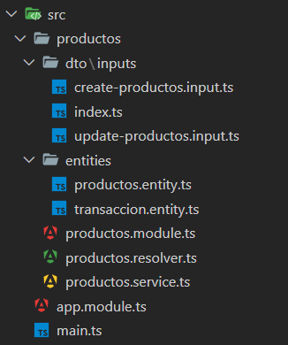

- Definimos la estructura de la entidad:

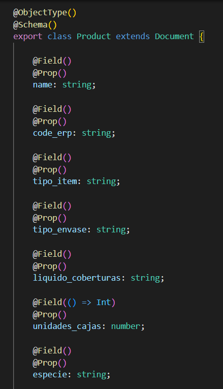

- Con la estructura de la entidad se define la entrada de los datos:

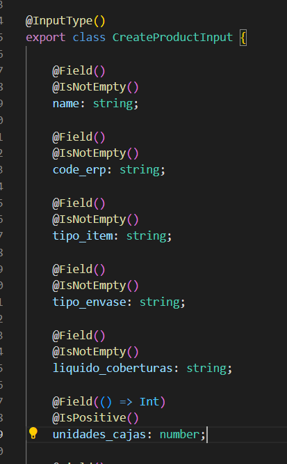

- Se deben establecer los querys y mutations que se podran realizar con esa entidad

  - En el archivo resolver se ubican la informacion de la base de datos

  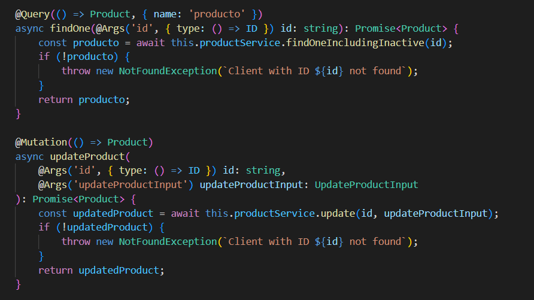

  - En el archivo service se ubican los querys y mutations que van ha ser realizado con la entidad

  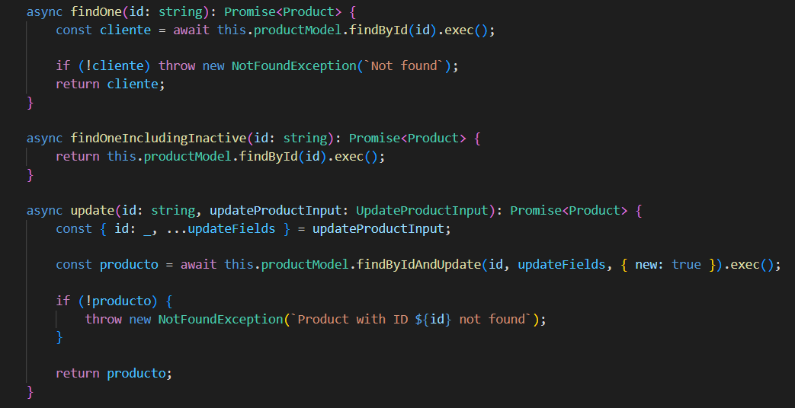

- Una vez se inicie el proyecto sera ejecutado en la ruta: 

```sh
http://localhost:3000/graphql
```
- Se ejecutara la siguiente interfaz:

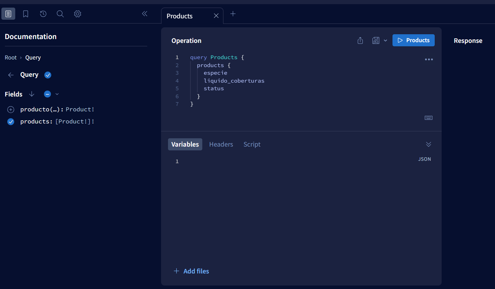

- Dentro de Graphql podremos hacer los querys y consultas que se han definido con anterioridad:

  - Consulta general:

  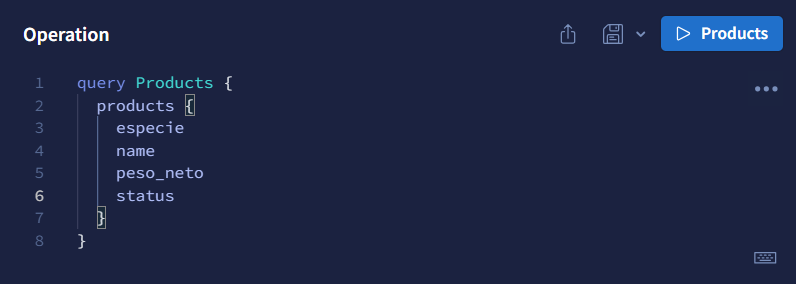

  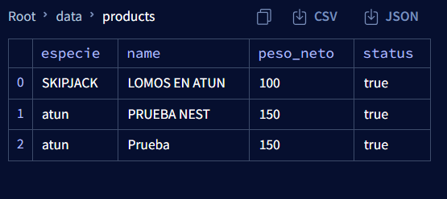

  - Consulta por ID:

  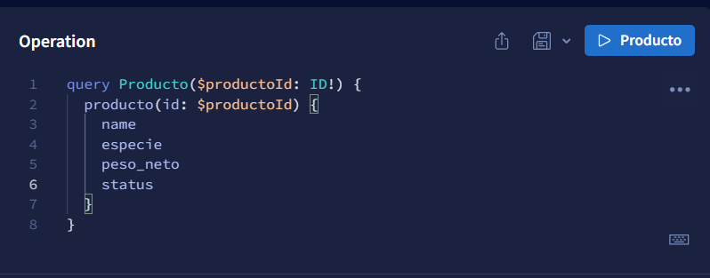

  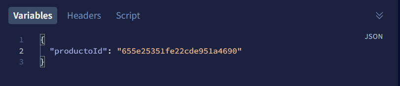

  

  - Creacion de Cliente:

  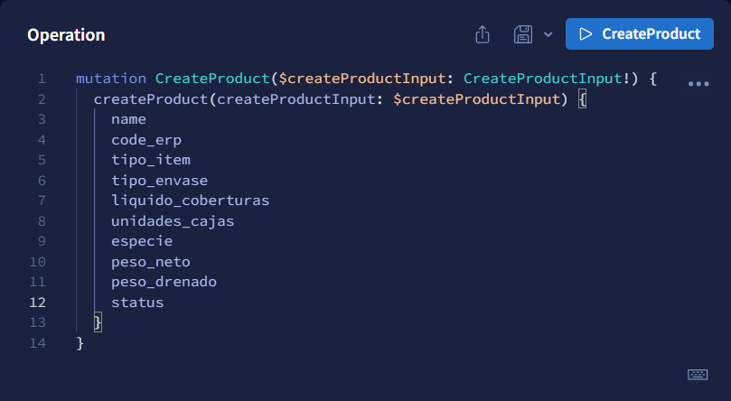

  

  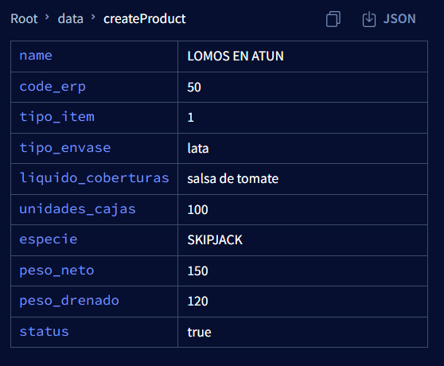

  - Actualizacion de Cliente:

  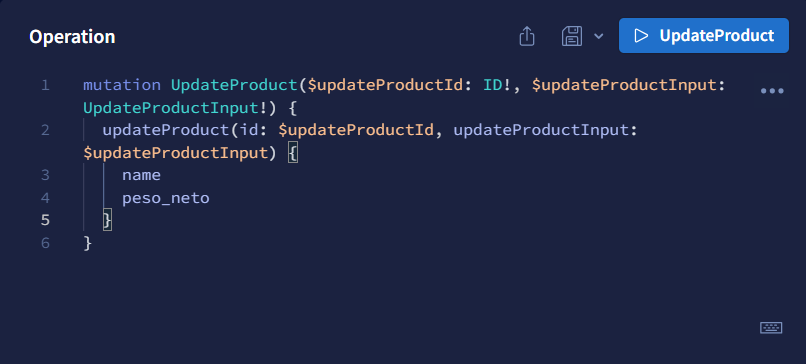

  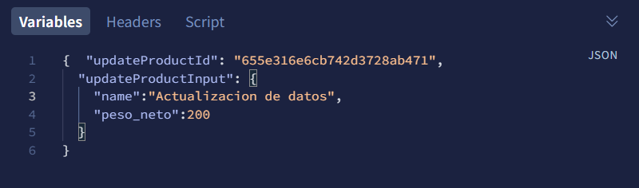

  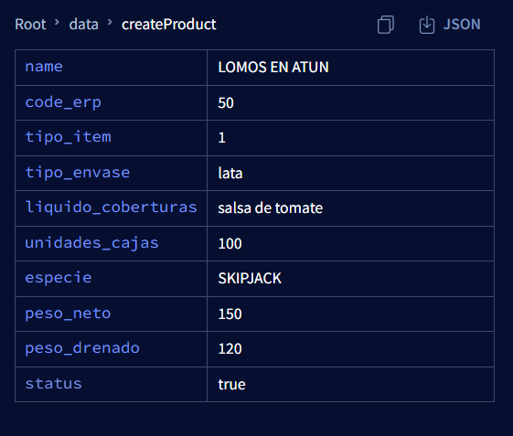

  - Eliminacion de Cliente:

  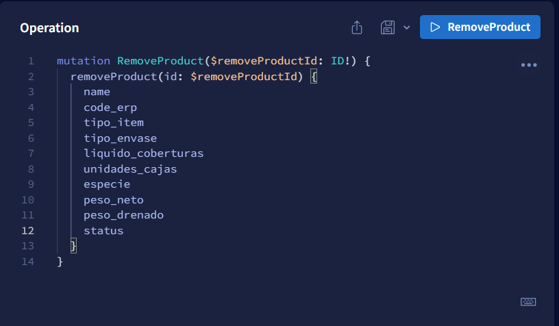

  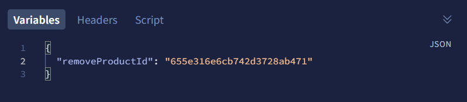

  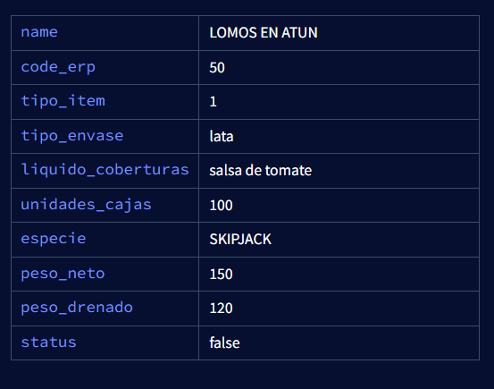

- Creacion de una nueva entidad

  - Definimos la estructura con su relacion (uno a muchos):

  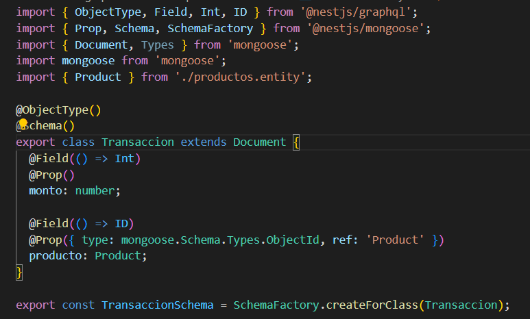

  - Creamos registros de las transacciones:

  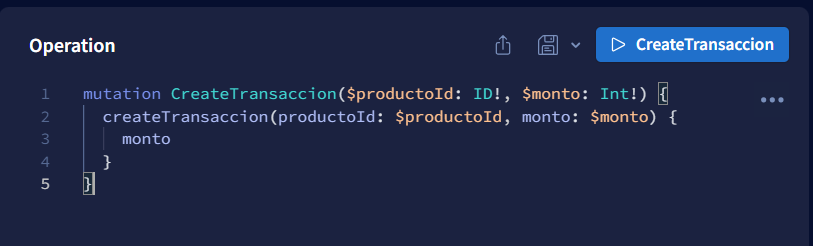

  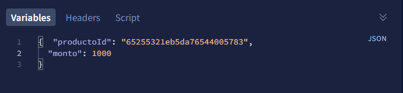

  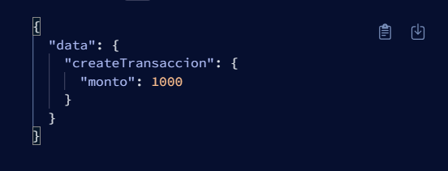

  - Consultamos los datos por ID del producto con las transacciones realizadas:

  

  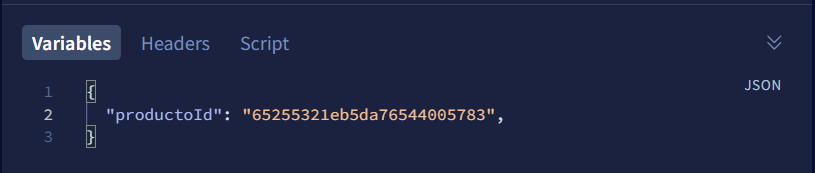

  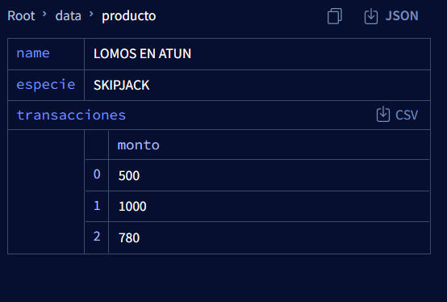